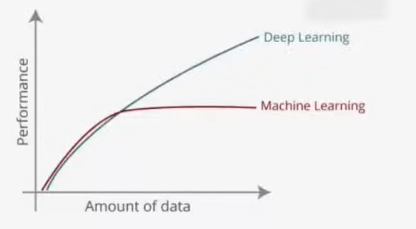

# Introduction to Deep Learning

## Definition 01

Deep learning is the subfield of Artificial Intelligence and Machine Learning that is inspired by structure of human brain, which means we do everything like ML, but the main difference is that ML depends mostly on statistical techniques to find the relation between input and output. Whereas DL depends on logical structure called Neural Network and this NN is inspired by human brain.

or

Deep learning algorithms attempt to draw similar conclusion as human would by continuously analyzing data with given logical structure called Neural Network.

## Definition 02

Deep learning is part of a broader family of ML methods based on Artificial Neural Networks with Representation Learning. Deep learning uses multiple layers to progressively extract higher-level features from raw input. For example, in image processing, lower layers may identify edges, while higher layers may identify the concept relevant to human such as digits, letter, shapes.

### What is Representation Learning?

Representation learning is a subset of machine learning that automatically discovers the best way to represent or "feature engineer" raw data (such as images, text, or audio) into a compact, meaningful format suitable for tasks like classification or prediction. It removes the need for manual, expert-driven feature engineering by learning hierarchical representations, typically using deep learning techniques.

So we just provide data in right format and DL algorithm automatically extract features based on its intelligence.

## Why DL is so famous?

1. Applicability
2. Perfomance

## Deep Learning vs. Machine Learning

1. **Data Requirement**: Deep learning requires significantly more data to perform better than traditional machine learning.

2. **Hardware**: Deep learning depends heavily on powerful GPUs and specialized hardware for fast computation.

3. **Training Time**: Deep learning models take much longer to train (weeks/months) but offer fast inference (prediction) times.

4. **Feature Engineering**: Deep learning automates feature extraction, whereas machine learning often requires manual feature engineering.

5. **Interpretability**: Deep learning models are often considered "black boxes" with low interpretability compared to traditional models.

Interpretability (or explainability) refers to how easily a human can understand why a model made a specific prediction. In the context of the Deep Learning vs. Machine Learning comparison, deep learning models act like a "black box".

Here are the key points regarding interpretability:

1. **The Black Box Problem**: In deep learning, automated feature extraction happens behind the scenes across many layers. Because these processes are so complex, it is difficult to determine exactly which specific features caused the final output.

2. **Lack of Justification**: If a deep learning model makes a decision, such as banning a user based on comments, it cannot explain why it made that decision. This creates issues in scenarios where transparency is legally or ethically required.

3. **Contrast with Machine Learning**: Traditional machine learning models, like Linear Regression or Decision Trees, have high interpretability. For example, a linear regression model provides weights for each feature, allowing you to explicitly see which factors were most important in the prediction

## Reasons for Deep Learning's Success

1. **Massive Data Availability**: The explosion of digital data (images, text, video) provides necessary training material.

2. **Advanced Hardware (GPUs/TPUs)**: The shift from CPUs to GPUs enabled parallel processing for neural networks.

3. **Modern Frameworks**: Libraries like TensorFlow (by Google) and PyTorch (by Facebook) made implementation accessible.

4. **Transfer Learning**: Utilizing pre-trained, state-of-the-art architectures (like VGG, BERT, YOLO) saves time and resources.